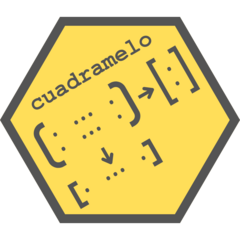

# ¡Cuádramelo! 

*Square it up for me!* This package has function for balancing and rounding matrices subject to restrictions. One can adjust the matrix so that columns and rows add up to given vectors, round a matrix keeping the column and row totals, etc.
